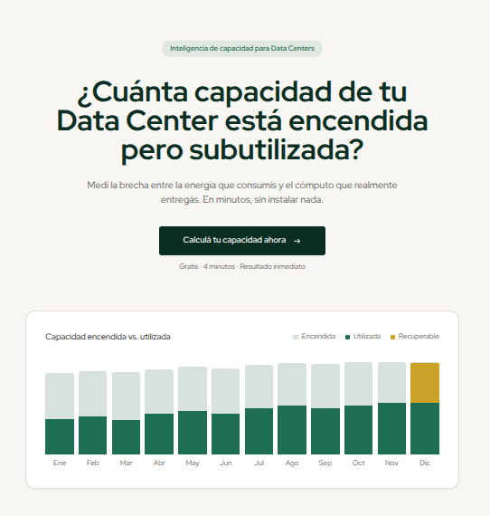

# No Country - S07-26-Team 11

## Infraestructura y PDF Generator



https://capacia.vercel.app/benchmark/reunion

[Documento-demo](./docs/assets/PDF-demo.pdf)

Plataforma Integrada de Benchmark de Data Centers

## Objetivo

**Infraestructura y PDF Generator** es la infraestructura que conecta tres componentes públicos de una startup de infraestructura de IA — el **reporte de industria**, la **calculadora de estimación** y el **benchmark de madurez** — y los convierte en un sistema integrado.

Un operador de data center entra por la calculadora, cuantifica cuánta capacidad está pagando sin producir nada, completa el benchmark de madurez, y recibe automáticamente un **PDF institucional** con su posición en la industria y sus KPIs. El equipo comercial ve las respuestas acumuladas en un dashboard y puede disparar campañas de invitación al benchmark desde una lista de contactos.

**Entregable de este proyecto:** todo lo anterior funcionando en un ambiente de **staging accesible públicamente**, como demo MVP.

**Duración:** 5 semanas (Semana 0 a Semana 4).

---

## Integrantes del equipo

> Completar: la primera prueba de que el flujo de Git funciona.

| Nombre | Rol | LinkedIn | GitHub / Sitio personal |
|---|---|---|---|
| Sebastian Di Giuseppe | Project Manager | [link](https://www.linkedin.com/in/sebadigiuseppe/) | [https://seba-dg-portfolio.ai.studio](https://seba-dg-portfolio.ai.studio) |
| Andrés Segura | Software / Solution Architect | [link](https://www.linkedin.com/in/andresseguradev/?lipi=urn%3Ali%3Apage%3Ad_flagship3_detail_base%3Bjf4i0OnwQYeGAAi6HP32xA%3D%3D) | [https://andres-segura.dev](https://andres-segura.dev) |
| Rider Renato Manrique | Backend Developer | [link](https://www.linkedin.com/in/rider-manrique/?lipi=urn%3Ali%3Apage%3Ad_flagship3_detail_base%3Bjf4i0OnwQYeGAAi6HP32xA%3D%3D) | - |
| Héctor Armando Cortez | Backend Developer | [link](https://www.linkedin.com/in/hector-cortez-cy/?lipi=urn%3Ali%3Apage%3Ad_flagship3_detail_base%3Bjf4i0OnwQYeGAAi6HP32xA%3D%3D) | - |
| Matias Almaraz | Backend Developer | [link](https://www.linkedin.com/in/matias-almaraz-197005275/?lipi=urn%3Ali%3Apage%3Ad_flagship3_detail_base%3Bjf4i0OnwQYeGAAi6HP32xA%3D%3D) | - |
| Augusto Zanetta | Backend Developer | [link](https://www.linkedin.com/in/augusto-zanetta-8745012b8/?lipi=urn%3Ali%3Apage%3Ad_flagship3_detail_base%3BqQ1Kj%2BpOQv%2BheNLtnVrzhw%3D%3D) | - |
| Oskar Morales | Full Stack Developer | [link](https://www.linkedin.com/in/oskarmorales/?lipi=urn%3Ali%3Apage%3Ad_flagship3_detail_base%3Bjf4i0OnwQYeGAAi6HP32xA%3D%3D) | - |
| Maria Daniela Monti Julien | Frontend Developer | [link](https://www.linkedin.com/in/mariamonti/?lipi=urn%3Ali%3Apage%3Ad_flagship3_detail_base%3Bjf4i0OnwQYeGAAi6HP32xA%3D%3D) | - |
| Vanina Restelli | UX/UI Designer | [link](https://www.linkedin.com/in/vaninarestelli/?lipi=urn%3Ali%3Apage%3Ad_flagship3_detail_base%3Bjf4i0OnwQYeGAAi6HP32xA%3D%3D) | - |
| Pamela Calafate | QA Tester | [link](https://www.linkedin.com/in/pamelacalafate/?lipi=urn%3Ali%3Apage%3Ad_flagship3_detail_base%3Bjf4i0OnwQYeGAAi6HP32xA%3D%3D) | - |

---

## Estructura del repositorio

Este es un **monorepo**: un solo repositorio de Git, una sola rama `main`, y cada entregable en su propio directorio con su propio README.

| Directorio | Entregable | Responsable principal | README |
|---|---|---|---|
| [`backend/`](backend/) | API, captura de email, PDF Generator, outreach | - | [ver](backend/README.md) |
| [`frontend/`](frontend/) | Sitio público (reporte, calculadora, benchmark) y dashboard interno | - | [ver](frontend/README.md) |
| [`database/`](database/) | Esquema PostgreSQL, migraciones, datos semilla | - | [ver](database/README.md) |
| [`testing/`](testing/) | Plan de pruebas, colecciones, E2E y reportes | - | [ver](testing/README.md) |
| [`design/`](design/) | Sistema de diseño, template del PDF, assets de marca | - | [ver](design/README.md) |
| [`docs/`](docs/) | Arquitectura, ADRs, contratos de datos, catálogo de endpoints | Arquitecto | [ver](docs/README.md) |

**Documentos raíz:**

- [`PROJECT.md`](PROJECT.md) — Guía del Project Manager: calendario, reuniones, seguimiento de entregables y relación con el cliente.
- [`CONTRIBUTING.md`](CONTRIBUTING.md) — Flujo de Git completo, convenciones de commits y reglas de PR.
- [`CLAUDE.md`](CLAUDE.md) — Contexto del proyecto para asistentes de IA.
- [`docs/API.md`](docs/API.md) — **Catálogo de todos los endpoints.** Contrato entre backend y frontend.

---

## Sobre el stack técnico de este arquetipo

El arquetipo trae Java 21 + Spring Boot + PostgreSQL en el backend y Next.js en el frontend. **Estas tecnologías son un punto de partida, no una imposición.**

Se eligieron por familiaridad con ellas y porque permiten arrancar el día 1 sin discutir. **La decisión final de cada equipo sobre su propia tecnología es suya.** Si el equipo de backend prefiere otro lenguaje o el de frontend otro framework, pueden cambiarlo — con dos condiciones innegociables:

1. **Se respeta el contrato de API** documentado en [`docs/API.md`](docs/API.md). El contrato es el límite entre equipos; lo que pase de ese límite hacia adentro es decisión de quien lo implementa.
2. **Se cumple el objetivo final** y el sistema queda desplegado en staging.

Todo cambio de tecnología se documenta con un ADR en [`docs/architecture/adr/`](docs/architecture/adr/), explicando por qué. No hace falta pedir permiso: hace falta dejar constancia.

---

## Secretos y variables de entorno

> **Regla número uno del proyecto: ningún secreto entra al repositorio. Nunca. Ni en una rama temporal, ni "solo para probar", ni comentado.**

Un secreto es cualquier cadena que dé acceso a algo: contraseñas de base de datos, API keys del proveedor de email, tokens de despliegue, claves de firma de JWT, URLs de conexión con credenciales embebidas.

### Cómo trabajamos con ellos

1. Cada directorio de proyecto tiene un archivo **`.env.example`** con **los nombres** de las variables y valores falsos de ejemplo. Ese archivo **sí** se versiona.
2. Cada persona copia `.env.example` a `.env` en su máquina y pone ahí los valores reales. El archivo `.env` **está en `.gitignore` y nunca se sube**.
3. Los valores reales se comparten por el **chat privado del equipo o un gestor de contraseñas**, nunca por el repositorio, nunca en un issue, nunca en un PR.
4. Cuando alguien agrega una variable nueva, **la agrega también a `.env.example`** en el mismo PR. Si no, el resto del equipo no puede levantar el proyecto y lo van a descubrir a las 11 de la noche.

---

## Cómo ejecutar el proyecto localmente

**Requisitos:** Git, Docker y Docker Compose (recomendado), o bien JDK 21 + Node 20+ + PostgreSQL 16 instalados directamente.

Antes que nada configurar ssh en tu perffil de Github, consultar con Solution Architect en caso de duda.

```bash
# 1. Clonar y posicionarse en la rama de trabajo
git clone git@github.com:No-Country-simulation/S07-26-Team-11.git
cd S07-26-Team-11/
git checkout dev

# 2. Configurar variables de entorno
cp backend/.env.example backend/.env
cp frontend/.env.example frontend/.env
# editar ambos .env con los valores reales

# 3. Levantar la base de datos (y opcionalmente todo el stack)
cd backend
docker compose up -d postgres      # solo la base de datos
# docker compose up --build        # todo el stack

# 4. Backend
./mvnw spring-boot:run             # http://localhost:8080
# Documentación de la API: http://localhost:8080/swagger-ui.html

# 5. Frontend (en otra terminal)
cd frontend
npm install
npm run dev                        # http://localhost:3000
```

Instrucciones detalladas y solución de problemas en el README de cada directorio.

---

## Dónde desplegar (opciones evaluadas por Architect Solution)

Ninguna está decidida. El equipo elige y lo registra en un ADR.

| Capa | Opciones | Nota |
|---|---|---|
| **Frontend** | Vercel (Hobby), Cloudflare Pages, Netlify | Vercel es lo natural para Next.js, pero **su plan Hobby prohíbe el uso comercial**: confirmar con el Project Manager o Cliente. Cloudflare Pages no tiene esa restricción |
| **Backend** | Render (free web service), Google Cloud Run, Azure/AWS free tier (12 meses) | Los servicios gratuitos de Render se apagan por inactividad y tardan cerca de un minuto en despertar. Mitigación: un ping programado antes de cada demo |
| **Base de datos** | Neon, Supabase, Render Postgres | Neon no pausa el proyecto y permite una rama de BD por rama de Git. Supabase pausa proyectos tras una semana de inactividad |
| **Storage de PDFs** | Cloudflare R2, Supabase Storage | R2 no cobra egreso |
| **Email** | Brevo (campañas, 300/día gratis), Resend (transaccional, ~3.000/mes) | Separarlos evita que una campaña bloquee los correos críticos del sistema |

---

