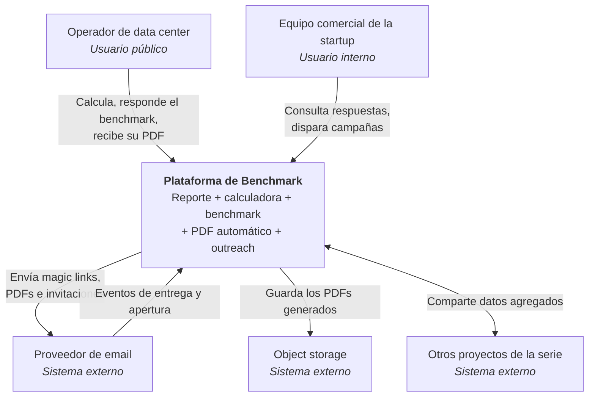

# A0 — Diagrama de contexto (C4 nivel 1)

**Versión:** A0 · **Fecha:** Semana 0 · **Responde:** quiénes usan el sistema y con qué habla.

## Actores

| Actor | Qué hace | Cómo se autentica |
|---|---|---|
| Operador de data center | Usa la calculadora, deja su email, completa el benchmark, descarga su PDF | Magic link por correo. Sin contraseña |
| Equipo comercial | Consulta leads y respuestas, sube listas y lanza campañas | Usuario y contraseña, roles `ADMIN` y `VIEWER` |
| Fundador | Recibe los leads. No usa el sistema directamente | — |
