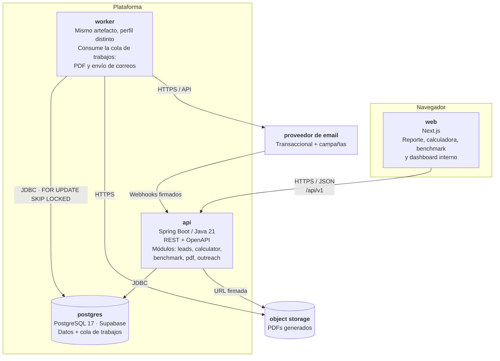

# A1 — Diagrama de contenedores (C4 nivel 2)

**Versión:** A1 · **Fecha:** Semana 0 · **Responde:** qué unidades desplegables hay y cómo se comunican.

## Decisiones incorporadas

- **`api` y `worker` son el mismo artefacto JAR** desplegado dos veces con perfiles de Spring distintos. Comparten el modelo de dominio y se separan de verdad el día que haga falta.
- **La cola vive en PostgreSQL**, con `SELECT ... FOR UPDATE SKIP LOCKED`. Sin Redis: menos infraestructura, comportamiento correcto con varios workers.
- **PostgreSQL es gestionado por Supabase**, no un contenedor propio. `api` y `worker` se conectan por el *session pooler* — ver [ADR-0004](adr/0004-supabase-postgres.md). El `postgres` de `docker-compose.yml` es solo para desarrollo local.
- **Nada bloqueante en el request HTTP.** Generar el PDF y enviar correos son trabajos asíncronos.
- **El dashboard interno vive dentro de `web`**, en rutas protegidas. No es un despliegue aparte.
