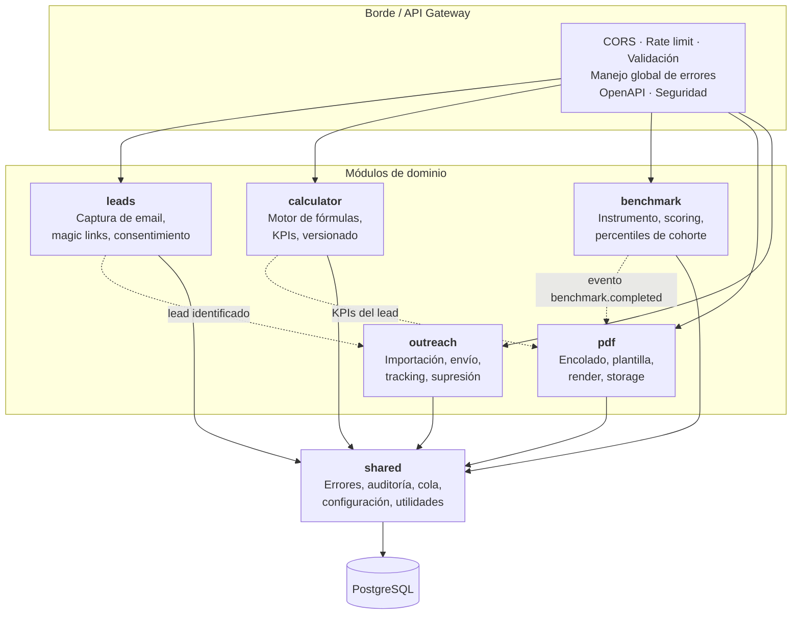

# A2 — Componentes del backend (C4 nivel 3)

**Versión:** A2 · **Fecha:** Semana 0 · **Responde:** qué módulos hay dentro de `api` y quién es responsable de cada uno.

## Fronteras entre módulos

**Regla dura:** ningún módulo importa clases internas de otro. Se comunican por interfaces públicas o por eventos de aplicación. Esto es lo que permite que varias personas trabajen en paralelo sin pisarse, y lo que permite reemplazar un módulo entero si hace falta.

| Módulo | Responsable | Depende de |
|---|---|---|
| `leads` | [Nombre] | `shared` |
| `calculator` | [Nombre] | `shared` |
| `benchmark` | [Nombre] | `shared` |
| `pdf` | [Nombre] | `shared`, eventos de `benchmark` y `calculator` |
| `outreach` | [Nombre] | `shared`, eventos de `leads` |
