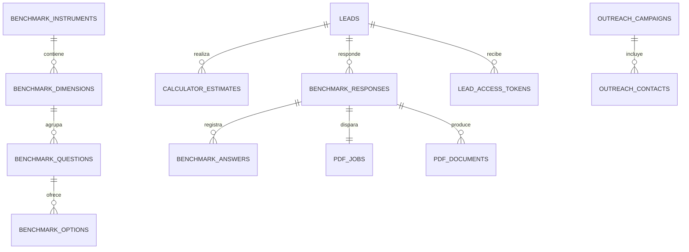

# database/docs/ — Diccionario de datos y diagrama ER

**Responsable:** el Data Owner.

## Que va aqui

| Archivo | Contenido |
|---|---|
| `er-diagram.md` | Diagrama entidad-relacion en Mermaid (`erDiagram`) |
| `diccionario.md` | Tabla por tabla: que significa cada columna, en lenguaje de negocio |
| `consultas-frecuentes.md` | Consultas del dashboard y de los agregados del reporte, con su plan de ejecucion |

## Por que importa

Si el Data Owner deja el proyecto, esto es lo unico que permite que otra persona retome
el modelo sin reconstruirlo leyendo las migraciones una por una. **Manten esto al dia
en el mismo PR que cambia el esquema**, no "despues".

## Plantilla del diagrama

