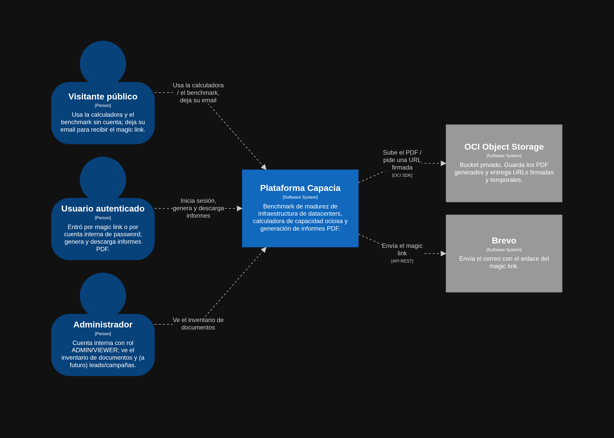
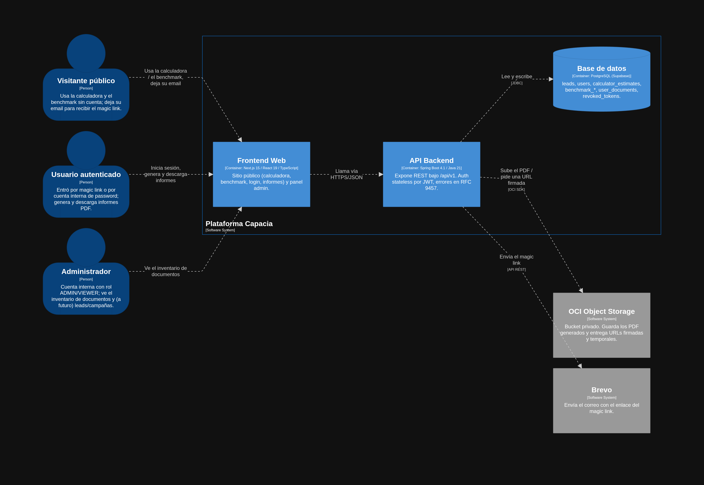
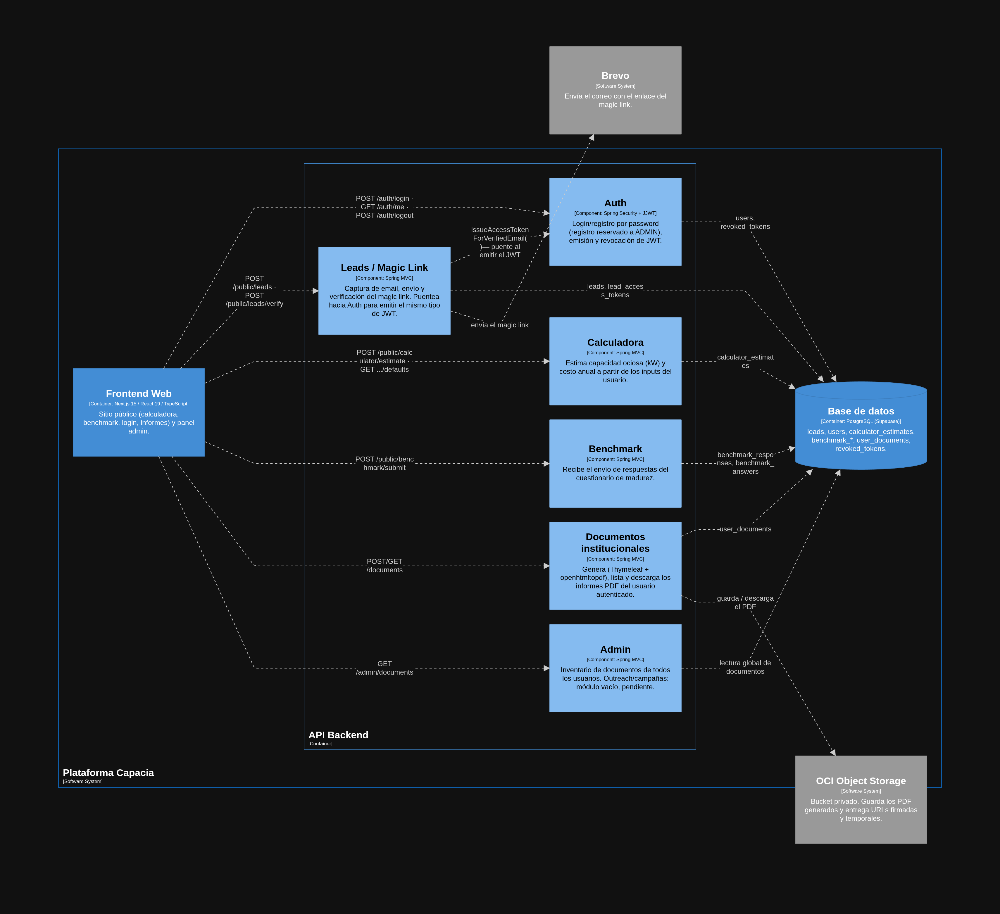

# docs/ — Documentación técnica

**Responsable** Andrés Segura 

**Objetivo:** ser la fuente de verdad de las decisiones técnicas y de los contratos entre equipos (actualización datos finales).

## Contenido

- [`stack.md`](stack.md) — stack técnico: backend, base de datos, proveedor del bucket, frontend.
- [`api-architecture.md`](api-architecture.md) — arquitectura de la API: autenticación, niveles de acceso, catálogo de endpoints.

- [`swagger-backend`](./openapi.yaml) — Puedes previsualizar con este documento o levantando el backend de este repositorio.

## Diagrama C4

- Contexto

- Contenedores

- Componntes API

El modelo fue generado usando el sofware Structurizr https://structurizr.com/

